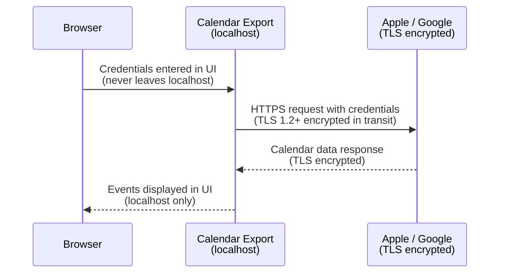

# Calendar Export

A browser-based tool for reviewing Apple and Google Calendar events and exporting a curated selection to an Outlook-compatible `.ics` file. Control which events include full details and which appear as anonymous time blocks.

## Requirements

- [Node.js](https://nodejs.org/) 20 or later
- npm (included with Node.js)

---

## Running the app

### Linux — desktop launcher (recommended)

Run the setup script once after cloning:

```bash
chmod +x install-linux.sh
./install-linux.sh
```

This generates a `Calendar Export.desktop` launcher for your machine and optionally adds it to your application menu. After that, double-click the launcher to start the app.

> **First time only:** if your file manager prompts you, choose **Run** (not Display). On GNOME you may also need to right-click → Allow Launching, or run:
> ```bash
> gio set "Calendar Export.desktop" metadata::trusted true
> ```

### Linux / macOS — terminal

```bash
npm install
npm run dev:all
```

Then open **http://localhost:5173** in your browser.

### Windows — double-click launcher

Double-click **`start.bat`** in the project folder. It will install dependencies on the first run, start both servers, and open your browser automatically.

> **Windows note:** If you see a SmartScreen warning, click "More info" → "Run anyway". The app runs entirely locally.

### Windows — terminal

```bat
npm install
npm run dev:all
```

Then open **http://localhost:5173** in your browser.

---

## Using the App

### 1. Load calendar data

On the opening screen, load your calendar data in one of four ways:

**From a file:**
- **Drag and drop** a `.ics` file onto the drop zone, or click to browse
- **Open .ics file** — a single exported calendar file
- **Open .icbu backup** — an Apple Calendar backup folder

To export from Apple Calendar: File → Export → Export… (`.ics`) or File → Export → Calendar Archive… (`.icbu`)

**From a calendar service:**
- **iCloud Calendar** — sign in directly (see [iCloud setup](#icloud-setup))
- **Google Calendar** — paste a secret iCal URL (see [Google Calendar setup](#google-calendar-setup))

---

### iCloud setup

Apple requires an **app-specific password** — your regular Apple ID password won't work here.

1. Go to [appleid.apple.com](https://appleid.apple.com) → Sign-In and Security → App-Specific Passwords
2. Click **Generate an app-specific password**, give it a name (e.g. "Calendar Export"), and copy the 16-character code
3. Enter your Apple ID email and paste that code into the app

Two-factor authentication must be enabled on your Apple ID for app-specific passwords to be available.

---

### Google Calendar setup

No account login or app registration required — Google Calendar provides a secret iCal URL you can paste directly:

1. Open [Google Calendar](https://calendar.google.com) and click the **gear icon (⚙) → Settings**
2. In the left sidebar under **"Settings for my calendars"**, click the calendar you want
3. Scroll down to the **"Integrate calendar"** section
4. Find **"Secret address in iCal format"** and click the **copy icon** next to it
5. Paste that URL into the app — add more URLs to include multiple calendars

> **Note:** Google updates iCal feeds with up to a 24-hour delay. Events added recently may not appear immediately.

---

### 2. Set a timeframe

Use the **From / to** date range in the top bar to limit which events are shown. Events outside the range are hidden and removed from the selection. Adjust at any time — selections for events still in view are preserved.

### 3. Select events

Click any event on the calendar to select it (highlighted in blue). Click again to deselect.

Use **Select all visible** in the sidebar to select every event in the current timeframe. Use **Clear all** to start over.

Switch between **Month**, **Week**, **Day**, and **List** views with the controls in the calendar header.

### 4. Choose detail level per event

Each selected event in the sidebar has an **Include details** toggle:

| Setting | What exports |
|---|---|
| ✅ Include details | Full event: title, time, description, location, organizer, attendees |
| ☐ Include details | Anonymous time block — appears as "event" with no identifying information |

Use anonymous mode to block out time on a recipient's calendar without revealing what the event is.

### 5. Export

Click **Export N events →** in the sidebar to download `export.ics`. Import it into Outlook:

- **Outlook (desktop):** File → Open & Export → Import/Export → Import an iCalendar (.ics)
- **Outlook (web):** Calendar → Add calendar → Upload from file

---

## Stopping the app

Click **Stop app** in the top-right corner of the app, or close the terminal window.

---

## Security & privacy

Calendar Export runs entirely on your machine. There is no remote server, no cloud service, and no account registration. Your credentials are never stored to disk (unless you use the optional credential store in a future release) and are only held in memory for the duration of your session.

The app does not use HTTPS for the local web page (`http://localhost:3000`) because all communication stays on your computer's loopback interface — it never touches a network. Browsers treat localhost as a [secure context](https://developer.mozilla.org/en-US/docs/Web/Security/Secure_Contexts).

When you connect to iCloud or Google Calendar, authentication does leave your machine — but only as a direct TLS-encrypted connection to Apple or Google's servers. The flow looks like this:



**Key points:**

- **Browser → App:** HTTP over localhost (loopback only, never on the network)
- **App → Apple/Google:** HTTPS with TLS encryption. Credentials are transmitted as HTTP Basic Auth (iCloud) or embedded in a secret URL (Google), both inside an encrypted TLS tunnel.
- **No third parties:** The app makes no requests to any server other than `caldav.icloud.com` (iCloud) or `calendar.google.com` (Google). No analytics, no telemetry, no phoning home.
- **App-specific passwords (iCloud):** Apple's app-specific passwords are scoped tokens that don't grant full account access. You can revoke them at any time from [appleid.apple.com](https://appleid.apple.com).
- **Secret iCal URLs (Google):** These are unguessable URLs that grant read-only access to a single calendar. You can reset them in Google Calendar settings at any time.

---

## Available scripts

| Command | What it does |
|---|---|
| `npm run dev` | Start the Vite frontend only (file import — no iCloud or Google Calendar) |
| `npm run server` | Start the proxy server only (port 3001) |
| `npm run dev:all` | Start both together (required for iCloud and Google Calendar) |
| `npm run build` | Production build to `dist/` |

The proxy server handles CalDAV requests to iCloud and iCal feed fetches for Google Calendar — both are blocked by browsers directly due to CORS restrictions.

---

## Building for production

```bash
npm run build
```

Output goes to `dist/`. The frontend can be served as a static site. For iCloud and Google Calendar support, run the proxy server (`node server.mjs`) alongside it.

---

## License

MIT — see [LICENSE](LICENSE).
